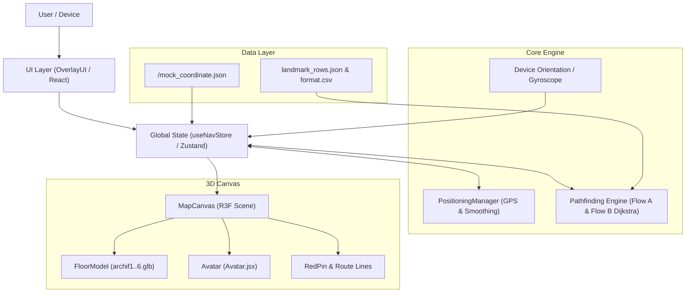
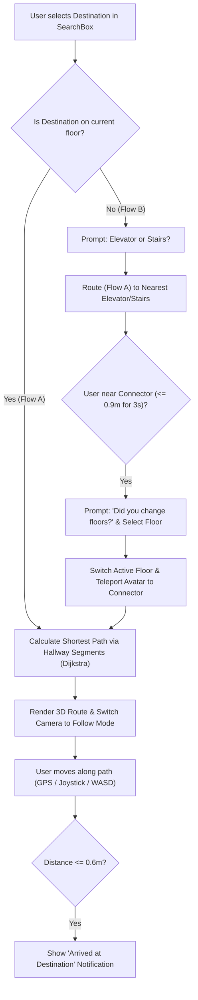
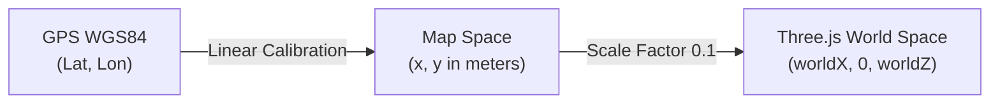

# KMUTNB Visual Map (Visualmap 1.0)

> **3D Indoor Navigation and Visualization System for Campus Buildings**  
> Developed for King Mongkut's University of Technology North Bangkok (KMUTNB).

---

## 📌 Overview

**KMUTNB Visual Map** is a modern, mobile-friendly 3D indoor navigation web application built with **React 19**, **Three.js**, **React Three Fiber (R3F)**, and **TypeScript**. 

The application offers an interactive, real-time spatial experience inside campus buildings across **Floors 1 through 6**. Users can explore floor layouts, search for rooms and facilities, navigate seamlessly across floors using stairs and elevators, and track their position using GPS, device sensors (compass / gyroscope), virtual on-screen joystick, or keyboard controls.

---

## ✨ Key Features

### 🏢 1. Interactive 3D Campus & Floor Visualization
- **Multi-Floor 3D Models (`.glb`)**: High-fidelity architectural models for Floors 1 to 6 (`archif1.glb` to `archif6.glb`).
- **Dynamic Floor Switching**: Seamlessly toggle between floors with dedicated floor selection controls.
- **Lighting & Shadows**: Contact shadows, ambient lighting, and environment mapping for realistic indoor rendering.
- **Interactive Raycasting & Snapping**: Click on the 3D map to inspect points or adjust coordinates with auto-snapping to the nearest hallway or landmark node.

### 🚶 2. 3D Avatars & Real-time Animation
- **Custom Character Selection**: Onboarding modal to pick between student avatars (Male / Female).
- **Smooth Skeletal Animations**: Idle, walk, and run states powered by `@react-three/drei`'s `useAnimations`.
- **Dynamic Elevation & Damping**: Smooth vertical lifting and position lerping when entering recalibration mode or switching floors.

### 🧭 3. Dual-Flow Indoor Navigation Engine
- **Flow A — Same-Floor Navigation**:
  - Automatically identifies nearest hallway segments to the user's position.
  - Computes the shortest path using a graph-based **Dijkstra algorithm**.
  - Renders an animated cyan path with directional arrows (`#22d3ee`).
  - Triggers arrival confirmation toast when within arrival threshold ($0.6\text{ m}$).
- **Flow B — Multi-Floor Navigation**:
  - Automatically activates when the target location is on a different floor.
  - Prompts user to choose transit method: **Elevator** (ลิฟต์) or **Stairs** (บันได).
  - Routes the user on the current floor to the nearest chosen connector.
  - Automatically detects when user reaches the connector (within $0.9\text{ m}$ for 3 seconds).
  - Prompts the user to confirm floor change, updates the avatar to the connector on the destination floor, and resumes **Flow A** to the final destination.

### 📍 4. Multi-Modal Positioning & Tracking
- **GPS Mode with Coordinate Calibration**:
  - Reads geographic GPS coordinates (`latitude`, `longitude`).
  - Calibrates GPS coordinates to local map coordinates (meters) using dual-origin calibration points.
  - Transforms map coordinates into 3D world coordinates ($X, Z$) with scale factor ($0.1$).
  - Implements sliding window smoothing (5-sample window) and accuracy threshold filtering ($\le 20\text{ m}$).
- **Sensor-Driven Follow Camera**:
  - Tracks device orientation (`DeviceOrientationEvent` / `webkitCompassHeading`) to align camera yaw with the user's real-world walking direction.
  - iOS-compatible sensor permission request workflow.
- **Manual Movement Controls**:
  - **Virtual On-Screen Touch Joystick**: Full $360^\circ$ multi-touch joystick optimized for mobile screens.
  - **WASD Keyboard Controls**: Quick avatar movement during desktop development and debugging.
- **Recalibration & Map Calibration Mode (`CAL`)**:
  - Manually reposition the avatar by tapping anywhere on the floor.
  - Smart snapping to the nearest valid hallway node or landmark.
  - Confirmation prompt to prevent accidental changes upon exiting.
- **Mock Coordinate System**:
  - Built-in polling mechanism for `/mock_coordinate.json` to simulate real-time moving coordinates during development without requiring physical GPS.

### 🔍 5. Search & Landmark Discovery
- **Bilingual Autocomplete**: Search across rooms, laboratories, department offices, elevators, and stairs using Thai (`name_th`) or English (`name_eng`).
- **Live Location Indicator**: Real-time HUD banner displaying the name of the nearest room or hallway segment.

---

## 🏗️ System Architecture



---

## 🗺️ Navigation Workflow (Flow A & Flow B)



---

## 📐 Coordinate Transformation Pipeline

The application maps geographic coordinates (WGS84 Lat/Lon) to Three.js 3D world space using a 3-step pipeline:



### Calibration Formula
Using two calibrated anchor points ($\text{Origin A}$ and $\text{Origin B}$):

$$\Delta \text{Lon} = \text{Origin B}_{\text{lon}} - \text{Origin A}_{\text{lon}}, \quad \Delta X = \text{Origin B}_{x} - \text{Origin A}_{x}$$

$$\Delta \text{Lat} = \text{Origin B}_{\text{lat}} - \text{Origin A}_{\text{lat}}, \quad \Delta Y = \text{Origin B}_{y} - \text{Origin A}_{y}$$

$$\text{Map } X = \text{Origin A}_{x} + (\text{Lon} - \text{Origin A}_{\text{lon}}) \times \frac{\Delta X}{\Delta \text{Lon}}$$

$$\text{Map } Y = \text{Origin A}_{y} + (\text{Lat} - \text{Origin A}_{\text{lat}}) \times \frac{\Delta Y}{\Delta \text{Lat}}$$

$$\text{World } X = \text{Map } X \times \text{WORLD\_SCALE}, \quad \text{World } Z = \text{Map } Y \times \text{WORLD\_SCALE}$$

*(Default `WORLD_SCALE = 0.1`)*

---

## 📁 Project Structure

```plaintext
Visualmap_1.0/
├── public/
│   ├── mock_coordinate.json      # Dynamic coordinate simulation file
│   └── models/
│       ├── archif1.glb .. archif6.glb   # 3D architectural floor models
│       ├── men_idle.glb, men_walk.glb   # Male avatar models & animations
│       ├── women_idle.glb, women_walk.glb # Female avatar models & animations
│       ├── redpin.glb                   # 3D destination marker pin
│       └── avartar_01.png, avartar_02.png # Avatar selection thumbnails
├── src/
│   ├── api/
│   │   └── axiosClient.ts        # Axios client with guest session header
│   ├── canvas/
│   │   ├── Avatar.jsx            # 3D animated character component & height lerp
│   │   ├── FloorModel.tsx        # 3D GLTF floor loader, raycaster & snap logic
│   │   ├── HallwaySegments.tsx   # Hallway debug wireframe visualization
│   │   ├── MapCanvas.tsx         # Main Three.js scene, lighting, camera controls
│   │   └── RedPin.tsx            # Animated 3D destination pin with floating oscillation
│   ├── components/
│   │   ├── FloorSelector.tsx     # Vertical floor switcher buttons (Floors 1-6)
│   │   ├── GPSButton.tsx         # Floating GPS tracking toggle button
│   │   ├── OverlayUI.tsx         # Primary HUD, navigation flow modals, virtual joystick
│   │   ├── SearchBox.tsx         # Room and landmark autocomplete search input
│   │   └── SetupModals.tsx       # Initial onboarding (avatar & floor selection)
│   ├── core/
│   │   ├── gps.ts                # Geolocation API & device motion/compass permissions
│   │   ├── pathfindingFlowA.ts   # Graph generation, Dijkstra algorithm, point projection
│   │   ├── positioning.ts        # PositioningManager with GPS sample smoothing
│   │   └── socket.ts             # Backend telemetry & position dispatcher stub
│   ├── data/
│   │   ├── format.csv            # Landmark nodes raw tabular dataset
│   │   ├── landmark.ts           # Landmarks with Lat/Lng geographical coordinates
│   │   ├── landmark_rows.json    # Master floor nodes, rooms, hallways, stairs & elevators
│   │   └── nodeWorldPosition.ts  # Node ID to 3D world coordinate resolver
│   ├── store/
│   │   └── useNavStore.ts        # Centralized Zustand store for state management
│   ├── App.tsx                   # Main application container
│   ├── main.tsx                  # Application entry point
│   └── index.css                 # Global styles & Tailwind directives
├── package.json
├── tsconfig.json
├── tailwind.config.js
└── vite.config.ts                # Vite config with HTTPS/SSL and LAN host enabled
```

---

## 🛠️ Technology Stack

| Category | Technologies |
| :--- | :--- |
| **Framework & Language** | [React 19](https://react.dev/), [TypeScript](https://www.typescriptlang.org/) |
| **3D Rendering Engine** | [Three.js](https://threejs.org/), [@react-three/fiber](https://docs.pmnd.rs/react-three-fiber), [@react-three/drei](https://github.com/pmndrs/drei) |
| **State Management** | [Zustand](https://github.com/pmndrs/zustand) |
| **Styling & Icons** | [Tailwind CSS v4](https://tailwindcss.com/), [Lucide React](https://lucide.dev/) |
| **Networking & API** | [Axios](https://axios-http.com/) |
| **Build Tooling** | [Vite 7](https://vitejs.dev/), [@vitejs/plugin-basic-ssl](https://github.com/vitejs/vite-plugin-basic-ssl) |
| **Device APIs** | Geolocation API, DeviceOrientationEvent (Compass/Gyroscope), Pointer Events |

---

## 🚀 Getting Started

### Prerequisites
- [Node.js](https://nodejs.org/) (Version 18+ recommended)
- `npm` or `yarn` / `pnpm`

### Installation

1. **Clone the repository:**
   ```bash
   git clone https://github.com/your-org/visualmap.git
   cd visualmap
   ```

2. **Install dependencies:**
   ```bash
   npm install
   ```

3. **Start the development server:**
   ```bash
   npm run dev
   ```

4. **Open in browser:**
   - Local: `https://localhost:5173`
   - Network: `https://<YOUR_LOCAL_IP>:5173`

> [!NOTE]
> The development server runs with **HTTPS enabled** via `@vitejs/plugin-basic-ssl`. This is **required** because modern mobile browsers restrict Geolocation and Device Orientation permissions to secure contexts (`https://`). Accept the self-signed certificate warning when opening the page on a mobile device.

### Production Build

To build the application for production:
```bash
npm run build
```

To preview the production build locally:
```bash
npm run preview
```

---

## 📱 Mobile Device Testing Guide

To test the application on a mobile smartphone on the same local Wi-Fi:

1. Connect your smartphone and development machine to the same Wi-Fi network.
2. In your terminal running `npm run dev`, find the **Network URL** (e.g., `https://192.168.1.xxx:5173`).
3. Open the URL in Safari (iOS) or Chrome (Android).
4. Tap **Advanced -> Proceed** to bypass the self-signed HTTPS certificate warning.
5. In the avatar selection modal, grant **Motion & Orientation Permissions** when prompted (required on iOS for compass heading).
6. Tap the **GPS** button in the bottom left corner to enable real-time device location tracking.

---

## 🎮 Controls & Shortcuts

| Action | Control Method |
| :--- | :--- |
| **Move Avatar (Mobile)** | Drag on-screen **Virtual Joystick** at bottom center |
| **Move Avatar (Desktop)** | Press <kbd>W</kbd> <kbd>A</kbd> <kbd>S</kbd> <kbd>D</kbd> keys |
| **Camera Rotate (Free Mode)** | Single-finger drag / Left-click drag |
| **Camera Pan (Free Mode)** | Two-finger drag / Right-click drag |
| **Camera Zoom (Free Mode)** | Pinch in/out / Mouse scroll wheel |
| **Adjust Camera Height (Follow Mode)** | Vertical swipe on screen / Mouse scroll wheel |
| **Toggle Camera Free/Follow** | Tap camera mode button (📷 / 🎥) in bottom right |
| **Recalibrate Avatar Position** | Tap **CAL** button, tap target location on 3D floor, confirm changes |

---

## 🧪 Development & Debugging Utilities

- **Mock Coordinate Override**: Edit `public/mock_coordinate.json` to immediately move the avatar in development mode:
  ```json
  { "x": 1.5, "z": -2.0 }
  ```
- **Coordinate Debug Panel**: Set `ENABLE_DEBUG_COORDINATE_PANEL = true` in `src/components/OverlayUI.tsx` to view live GPS Lat/Lng, 3D avatar coordinates, floor dimensions, and raycast hit coordinates.
- **Hallway Wireframe Overlay**: Set `ENABLE_HALLWAY_SEGMENTS = true` in `src/canvas/HallwaySegments.tsx` to visualize all floor hallway connection lines.
- **GLB Inspection Scripts**: Run utility scripts (`node tmp-inspect-glb.cjs`) to inspect root nodes, transformations, and bounding dimensions of floor GLB assets.

---

## 📄 License

This project is developed for educational and institutional use at **King Mongkut's University of Technology North Bangkok (KMUTNB)**.
